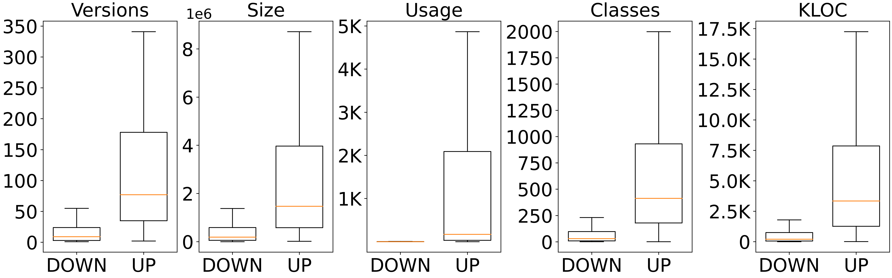

# Data description

## Overview

The following figure shows various metadata of the collected dataset, and more detailed information is available in Section III-A of the paper.



## Artifact and vulnerability

The information and structure of each table is as follows:

+ ARTIFACT:

  ```
  GROUP_ID | ARTIFACT_ID | VERSION | LOC |  USAGE_NUM | CLASS_NUM | ID
  ```

+ CVE:

  ```
  CVE_ID | CVSS | CWE | VUL_FUNs
  ```

+ DEP

  ```
  UP_GAV_ID(referred from ARTIFACT) | DOWN_GAV_ID(referred from ARTIFACT) 
  ```

+ PATCH

  ```
  CVE(referred from CVE) | Patch | AFFECT_GAV_ID(referred from ARTIFACT)
  ```

This dataset contains CVEs and the detailed information of the corresponding patches and affected artifacts.

## Downstream response

Downstream response is hold in response.csv file and the structure is as follows:

```
CVE | Upstream_GAV | Downstream_GAV | Downstream_repo | Downstream_commit
```

## Plot Script

This directory contains scripts for the figures of the three research questions, all of which can be run directly from their current directories.

## Folder Structure

```
.
├── LICENSE
├── README.md
├── analyseJar
│   ├── README.md
│   ├── analyseJar.jar
│   ├── example
│   │   ├── RI
│   │   ├── callstack
│   │   └── jar_to_analyse
│   ├── use_networkx.py
│   └── use_networkx_shortest.py
├── csv
│   ├── ARTIFACT.csv
│   ├── CVE.csv
│   ├── DEP.csv
│   ├── PATCH.csv
│   ├── README.md
│   └── RESPONSE.csv
├── paper.pdf
├── plot_script
│   ├── README.md
│   ├── RQ1
│   │   ├── RQ1.1
│   │   └── RQ1.2
│   ├── RQ2
│   │   ├── constraint
│   │   ├── downstream_context
│   │   └── exploitable_path_ratio
│   ├── RQ3
│   │   ├── distribution
│   │   ├── overview
│   │   ├── response_speed
│   │   └── survey
│   └── data_collection
│       ├── data_overview.pdf
│       ├── data_overview.png
│       ├── downstream
│       ├── draw_boxplot.py
│       └── upstream
└── requirements.txt
```
